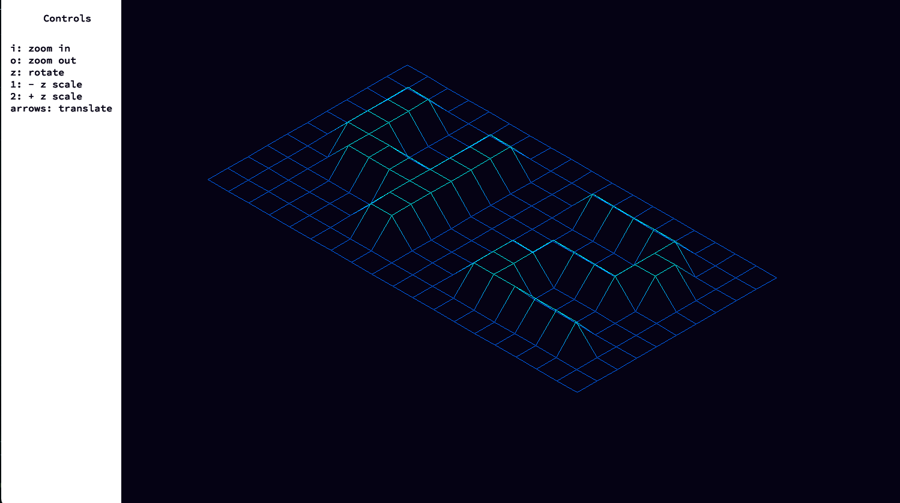

# FdF


--

*A simple 3D wireframe viewer written in C.  
Loads and displays `.fdf` map files in isometric projection.*

## Map example
```
0  0  0  0  0  0  0  0  0  0  0  0  0  0  0  0  0  0  0
0  0  0  0  0  0  0  0  0  0  0  0  0  0  0  0  0  0  0
0  0 10 10  0  0 10 10  0  0  0 10 10 10 10 10  0  0  0
0  0 10 10  0  0 10 10  0  0  0  0  0  0  0 10 10  0  0
0  0 10 10  0  0 10 10  0  0  0  0  0  0  0 10 10  0  0
0  0 10 10 10 10 10 10  0  0  0  0 10 10 10 10  0  0  0
0  0  0 10 10 10 10 10  0  0  0 10 10  0  0  0  0  0  0
0  0  0  0  0  0 10 10  0  0  0 10 10  0  0  0  0  0  0
0  0  0  0  0  0 10 10  0  0  0 10 10 10 10 10 10  0  0
0  0  0  0  0  0  0  0  0  0  0  0  0  0  0  0  0  0  0
0  0  0  0  0  0  0  0  0  0  0  0  0  0  0  0  0  0  0
```

## Preview

